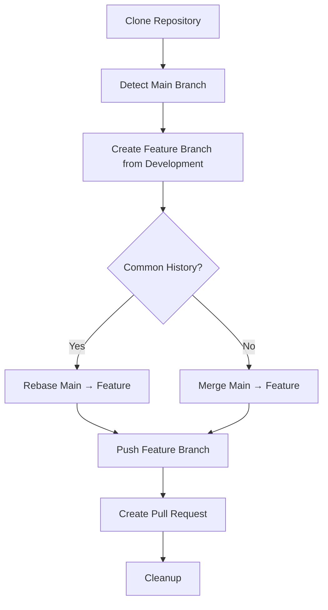

# Git Branch Synchronization Script

[](https://opensource.org/licenses/MIT)
[](https://www.gnu.org/software/bash/)
[](https://github.com/enterprise)

> 🚀 **Automated script for synchronizing commits from the main branch (`main`/`master`) to the `development` branch when both are protected using branch protection rules.**

## ⭐ Features

- ✅ **Automatic branch detection** (`main` or `master`)
- ✅ **GitHub.com and GitHub Enterprise support**
- ✅ **Automatic conflict resolution** with configurable strategies
- ✅ **Pull Request creation** via GitHub API
- ✅ **Comprehensive logging** and error handling
- ✅ **Protected branch workflow** compliance
- ✅ **Cross-platform compatibility** (Windows, macOS, Linux)

## 🎯 Objective

This script solves the challenge of synchronizing commits between protected branches (`main`/`master` and `development`) by automatically creating:
1. A feature branch from `development`
2. Merge/rebase of commits from `main`/`master`
3. Automatic Pull Request for review and merge

**Perfect for environments where both branches have branch protection rules enabled.**

## 📋 Prerequisites

- **Git**: Installed and configured globally
- **Bash**: Terminal with bash support (Git Bash on Windows)
- **Personal Access Token (PAT)**: GitHub token with repo permissions

### Git Configuration (Optional)

The script automatically uses your global Git configuration:
```bash
git config --global user.name "Your Name"
git config --global user.email "your.email@company.com"
```

## 🚀 Usage

### Basic syntax:
```bash
./trim_branches.sh <repository_url> <personal_access_token> [feature_branch_name] [git_user_name] [git_user_email]
```

### Parameters:

| Parameter | Required | Description | Example |
|-----------|----------|-------------|---------|
| `repository_url` | ✅ | Git repository URL | `https://github.com/team/project.git` |
| `personal_access_token` | ✅ | Authentication token | `ghp_xxxxxxxxxxxx` |
| `feature_branch_name` | ❌ | Feature branch name | `feature/sync-branches` |
| `git_user_name` | ❌ | Name for commits | `"John Doe"` |
| `git_user_email` | ❌ | Email for commits | `"john.doe@company.com"` |

## 📝 Usage Examples

### Basic usage (recommended):
```bash
./trim_branches.sh https://github.com/team/project.git ghp_xxxxxxxxxxxx
```

### With custom branch:
```bash
./trim_branches.sh https://github.com/team/project.git ghp_xxxxxxxxxxxx feature/sync-main-to-dev
```

### With specific Git configuration:
```bash
./trim_branches.sh https://github.com/team/project.git ghp_xxxxxxxxxxxx feature/sync-branches "John Doe" "john.doe@company.com"
```

## 🔧 Features

### ✅ Automatic Detection
- **Main branch**: Automatically detects `main` or `master` (prioritizes `main`)
- **Git configuration**: Uses your global configuration or defaults
- **Common history**: Handles branches with or without common history

### ⚡ Conflict Management
- **Automatic resolution**: Accepts changes from the main branch
- **Flexible strategies**: Rebase for common history, merge for independent histories
- **Automatic cleanup**: Removes temporary files

### 🔄 GitHub Integration
- **API compatibility**: Compatible with GitHub.com and GitHub Enterprise
- **Automatic Pull Request**: Creates PR with detailed description
- **Connectivity validation**: Verifies API access before creating PR

## 🛡️ Personal Access Token Setup

### 🔑 Required Permissions

The script needs specific permissions to function correctly:

#### ✅ **Essential Permissions (Required):**
- **`repo`** - Full control of private repositories
  - ✅ `repo:status` - Access commit status
  - ✅ `repo_deployment` - Access deployment status  
  - ✅ `public_repo` - Access public repositories
  - ✅ `repo:invite` - Access repository invitations
  - ✅ `security_events` - Read security events

#### 🔧 **What the script does with each permission:**
- **Clone repository**: Requires `repo` access to download repository content
- **Create branches**: Needs `repo` write access to push new branches
- **Create Pull Requests**: Requires `repo` access to use GitHub API
- **Read user info**: Uses API to validate token (automatic test)

#### 🏢 **For GitHub Enterprise:**
- Same permissions as GitHub.com
- Ensure your token has access to the specific organization/repository
- Verify SSO authorization if required by your organization

### 📝 **Step-by-Step Token Creation:**

#### For GitHub.com:
1. **Navigate to**: [Settings → Developer settings → Personal access tokens → Tokens (classic)](https://github.com/settings/tokens)
2. **Click**: "Generate new token (classic)"
3. **Set expiration**: Choose appropriate duration (30-90 days recommended)
4. **Select permissions**:
   ```
   ☑️ repo (Full control of private repositories)
   ```
5. **Generate token** and **copy immediately** (you won't see it again!)

#### For GitHub Enterprise:
1. **Navigate to**: `https://your-github-enterprise.com/settings/tokens`
2. **Follow same steps** as GitHub.com
3. **Additional considerations**:
   - Check if SSO authorization is required
   - Verify organization access permissions
   - Confirm API endpoint accessibility

### 🔒 **Security Best Practices:**

- ✅ **Store securely**: Never commit tokens to repositories
- ✅ **Use environment variables**: `export GITHUB_TOKEN=your_token`
- ✅ **Regular rotation**: Regenerate tokens periodically
- ✅ **Minimum permissions**: Only grant necessary access
- ✅ **Monitor usage**: Review token activity regularly

### ⚠️ **Token Validation:**

The script automatically tests your token with:
```bash
curl -H "Authorization: token YOUR_TOKEN" https://api.github.com/user
```

**If you see errors:**
- `401 Unauthorized`: Token is invalid or expired
- `403 Forbidden`: Insufficient permissions or rate limiting
- `404 Not Found`: Repository doesn't exist or no access

## 📊 Workflow



## 🚨 Specific Use Cases

### Repositories with divergent branches:
The script automatically detects when `main`/`master` and `development` have no common history and uses `--allow-unrelated-histories`.

### Merge conflicts:
All conflicts are automatically resolved by prioritizing changes from the main branch.

### Multiple executions:
If the feature branch already exists, it is automatically deleted and recreated.

## 🐛 Troubleshooting

### 🔐 **Authentication & Permission Errors**

#### **Error 401 - Unauthorized**
```bash
[ERROR] API connectivity test failed (HTTP 401)
```
**Possible causes:**
- ❌ Token is invalid or expired
- ❌ Token not properly formatted (missing `ghp_` prefix for classic tokens)
- ❌ Token was revoked

**Solutions:**
- ✅ Generate a new token
- ✅ Verify token format: `ghp_xxxxxxxxxxxxxxxxxxxx`
- ✅ Check token expiration date

#### **Error 403 - Forbidden**
```bash
[ERROR] Authentication failed or insufficient permissions
```
**Possible causes:**
- ❌ Missing `repo` permission on token
- ❌ SSO not authorized (GitHub Enterprise)
- ❌ Rate limiting exceeded
- ❌ Repository access denied

**Solutions:**
- ✅ Add `repo` permission to token
- ✅ Authorize SSO if required: Settings → Applications → Authorized OAuth Apps
- ✅ Wait for rate limit reset (usually 1 hour)
- ✅ Verify repository access in web interface

#### **Error 404 - Repository Not Found**
```bash
[ERROR] Repository not found or API endpoint incorrect  
```
**Possible causes:**
- ❌ Repository URL incorrect
- ❌ No access to private repository
- ❌ Organization/repo name changed
- ❌ Wrong GitHub Enterprise URL

**Solutions:**
- ✅ Verify repository exists: visit URL in browser
- ✅ Check repository permissions
- ✅ Confirm GitHub Enterprise server URL
- ✅ Verify organization access

### 🔧 **Script Execution Errors**

#### **Error 422 - Validation Failed**
```bash
[ERROR] Error creating Pull Request (HTTP 422)
```
**Possible causes:**
- ❌ `development` branch doesn't exist
- ❌ Trying to create PR with no changes
- ❌ Invalid branch names
- ❌ JSON parsing issues

**Solutions:**
- ✅ Create `development` branch first
- ✅ Verify branches have different content
- ✅ Check branch naming conventions

#### **Branch-related Issues**
```bash
[INFO] Branch 'development' does not exist in the repository
```
**Solution:** Create the development branch:
```bash
git checkout -b development
git push origin development
```

### 🌐 **GitHub Enterprise Specific Issues**

#### **API Endpoint Problems**
- ✅ Verify API URL format: `https://your-github-enterprise.com/api/v3/`
- ✅ Check network connectivity to enterprise server
- ✅ Confirm API is enabled on your GitHub Enterprise instance

#### **SSO Authorization**
- ✅ Go to: Settings → Applications → Authorized OAuth Apps
- ✅ Find your token and click "Grant" next to organization name
- ✅ Re-run script after authorization

## 🤝 Contributing

Contributions are welcome! Please feel free to submit a Pull Request. For major changes, please open an issue first to discuss what you would like to change.

### Development Guidelines

1. **Fork** the repository
2. **Create** a feature branch (`git checkout -b feature/amazing-feature`)
3. **Commit** your changes (`git commit -m 'Add some amazing feature'`)
4. **Push** to the branch (`git push origin feature/amazing-feature`)
5. **Open** a Pull Request

## 📄 License

This project is licensed under the MIT License - see the [LICENSE](LICENSE) file for details.

## 🙏 Acknowledgments

- Inspired by the need for efficient protected branch workflows
- Built following GitHub Enterprise Server API best practices
- Thanks to the open-source community for continuous inspiration

## 📞 Support

If you encounter any issues or have questions:

1. **Check** the [troubleshooting section](#-troubleshooting)
2. **Search** existing issues
3. **Create** a new issue with detailed information

---
**Created by**: [ijavidilo](https://github.com/ijavidilo)  
**Last updated**: September 2025