# Git Branch Synchronization Script

[](https://opensource.org/licenses/MIT)
[](https://www.gnu.org/software/bash/)
[](https://github.com/enterprise)

> 🚀 **Automated script for synchronizing commits from the main branch (`master`/`main`) to the `development` branch when both are protected using branch protection rules.**

## ⭐ Features

- ✅ **Automatic branch detection** (`master` or `main`)
- ✅ **GitHub.com and GitHub Enterprise support**
- ✅ **Automatic conflict resolution** with configurable strategies
- ✅ **Pull Request creation** via GitHub API
- ✅ **Comprehensive logging** and error handling
- ✅ **Protected branch workflow** compliance
- ✅ **Cross-platform compatibility** (Windows, macOS, Linux)

## 🎯 Objective

This script solves the challenge of synchronizing commits between protected branches (`master`/`main` and `development`) by automatically creating:
1. A feature branch from `development`
2. Merge/rebase of commits from `master`/`main`
3. Automatic Pull Request for review and merge

**Perfect for environments where both branches have branch protection rules enabled.**

## 📋 Prerequisites

- **Git**: Installed and configured globally
- **Bash**: Terminal with bash support (Git Bash on Windows)
- **Personal Access Token (PAT)**: GitHub token with repo permissions

### Git Configuration (Optional)

The script automatically uses your global Git configuration:
```bash
git config --global user.name "Your Name"
git config --global user.email "your.email@company.com"
```

## 🚀 Usage

### Basic syntax:
```bash
./trim_branches.sh <repository_url> <personal_access_token> [feature_branch_name] [git_user_name] [git_user_email]
```

### Parameters:

| Parameter | Required | Description | Example |
|-----------|----------|-------------|---------|
| `repository_url` | ✅ | Git repository URL | `https://github.com/team/project.git` |
| `personal_access_token` | ✅ | Authentication token | `ghp_xxxxxxxxxxxx` |
| `feature_branch_name` | ❌ | Feature branch name | `feature/sync-branches` |
| `git_user_name` | ❌ | Name for commits | `"John Doe"` |
| `git_user_email` | ❌ | Email for commits | `"john.doe@company.com"` |

## 📝 Usage Examples

### Basic usage (recommended):
```bash
./trim_branches.sh https://github.com/team/project.git ghp_xxxxxxxxxxxx
```

### With custom branch:
```bash
./trim_branches.sh https://github.com/team/project.git ghp_xxxxxxxxxxxx feature/sync-master-to-dev
```

### With specific Git configuration:
```bash
./trim_branches.sh https://github.com/team/project.git ghp_xxxxxxxxxxxx feature/sync-branches "John Doe" "john.doe@company.com"
```

## 🔧 Features

### ✅ Automatic Detection
- **Main branch**: Automatically detects `main` or `master`
- **Git configuration**: Uses your global configuration or defaults
- **Common history**: Handles branches with or without common history

### ⚡ Conflict Management
- **Automatic resolution**: Accepts changes from the main branch
- **Flexible strategies**: Rebase for common history, merge for independent histories
- **Automatic cleanup**: Removes temporary files

### 🔄 GitHub Integration
- **API compatibility**: Compatible with GitHub.com and GitHub Enterprise
- **Automatic Pull Request**: Creates PR with detailed description
- **Connectivity validation**: Verifies API access before creating PR

## 🛡️ Personal Access Token Setup

### Required permissions:
- `repo` (full repository access)
- `workflow` (if using GitHub Actions)

### Create PAT:
1. Go to: **Settings → Developer settings → Personal access tokens → Tokens (classic)**
2. Select the necessary permissions
3. Copy the generated token

## 📊 Workflow

```mermaid
graph TD
    A[Clone Repository] --> B[Detect Main Branch]
    B --> C[Create Feature Branch from Development]
    C --> D{Common History?}
    D -->|Yes| E[Rebase Master → Feature]
    D -->|No| F[Merge Master → Feature]
    E --> G[Push Feature Branch]
    F --> G
    G --> H[Create Pull Request]
    H --> I[Cleanup]
```



## 🚨 Specific Use Cases

### Repositories with divergent branches:
The script automatically detects when `master` and `development` have no common history and uses `--allow-unrelated-histories`.

### Merge conflicts:
All conflicts are automatically resolved by prioritizing changes from the main branch.

### Multiple executions:
If the feature branch already exists, it is automatically deleted and recreated.

## 🐛 Troubleshooting

### Error 404 - Repository not found:
- Verify the repository URL
- Confirm access permissions with the PAT

### Error 401/403 - Authentication:
- Verify that the PAT is valid
- Confirm token permissions (`repo`)

### Error 422 - Validation Failed:
- Ensure the `development` branch exists
- Verify that branches have content

## 🤝 Contributing

Contributions are welcome! Please feel free to submit a Pull Request. For major changes, please open an issue first to discuss what you would like to change.

### Development Guidelines

1. **Fork** the repository
2. **Create** a feature branch (`git checkout -b feature/amazing-feature`)
3. **Commit** your changes (`git commit -m 'Add some amazing feature'`)
4. **Push** to the branch (`git push origin feature/amazing-feature`)
5. **Open** a Pull Request

## 📄 License

This project is licensed under the MIT License - see the [LICENSE](LICENSE) file for details.

## 🙏 Acknowledgments

- Inspired by the need for efficient protected branch workflows
- Built following GitHub Enterprise Server API best practices
- Thanks to the open-source community for continuous inspiration

## 📞 Support

If you encounter any issues or have questions:

1. **Check** the [troubleshooting section](#-troubleshooting)
2. **Search** existing issues
3. **Create** a new issue with detailed information

---
**Created by**: [ijavidilo](https://github.com/ijavidilo)  
**Last updated**: September 2025